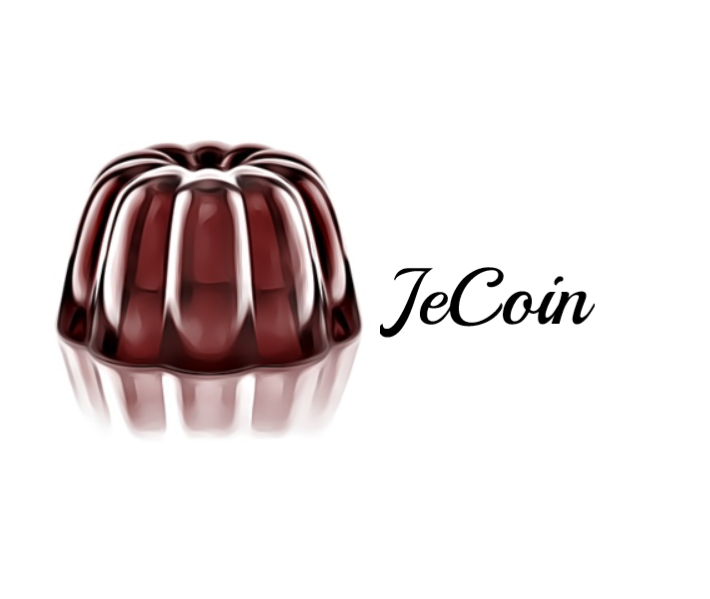

<div align="center">
	<br/>
	
	<br/>
	<div><b>A simple, educational-purpose blockchain</b></div>
	<br/>
	<a href="https://github.com/nguyenphuminh/JeChain/blob/master/LICENSE.md"></a>
	<a href="https://github.com/nguyenphuminh/JeChain/releases"></a>
</div>

## What is JeChain?
JeChain is a proof-of-work blockchain created using Javascript, originally used in [this series on dev.to](https://dev.to/freakcdev297/series/15322). If you are here for that, consider checking out [this repo](https://github.com/nguyenphuminh/blockchain-tutorial/tree/main/Creating%20a%20blockchain%20in%2060%20lines%20of%20Javascript).

To know how this code work properly, you can check out the tutorial series on dev.to:
* [Part 1: Creating a blockchain in 60 lines of Javascript](https://dev.to/freakcdev297/creating-a-blockchain-in-60-lines-of-javascript-5fka)
* [Part 2: Creating a cryptocurrency - Creating transactions, mining rewards, mint and gas fee ](https://dev.to/freakcdev297/creating-transactions-mining-rewards-mint-and-gas-fee-5hhf)
* [Part 3: Build a p2p network and release your cryptocurrency](https://dev.to/freakcdev297/build-a-p2p-server-and-release-your-cryptocurrency-2l0f)

## Why JeChain?
JeChain was created for educational purposes, also as an attempt trying to create a full-blown blockchain network.

## Setup and use
First, be sure to have Nodejs installed on your machine first.

Next, install all the needed packages:
```
npm install
```

If you haven't had your keys, goto `./utils` and type `node keygen`, it will generate a key pair for you. 

Then, if you want to start a node, open the terminal, configure it first:
```sh
# PORT
PORT=Insert your port here
# Peers to connect when startup
PEERS=Address 1, address 2, address 3
# Set your address
MY_ADDRESS=ws://your.ip.and:port
# Set your private key
PRIVATE_KEY=your key

# Start the node
node jecoin
```

The equivalent of this on Windows is `set var_name=value`

You can mine a block like this:
```js
if (JeChain.transactions.length !== 0) {
    JeChain.mineTransactions(publicKey);

    sendMessage(produceMessage("TYPE_REPLACE_CHAIN", [
        JeChain.getLastBlock(),
        JeChain.difficulty
    ]));
}
```

You can create a transaction like this:
```js
sendMessage(produceMessage("TYPE_CREATE_TRANSACTION", someTransaction));
JeChain.addTransaction(someTransaction);
```

You can request for a chain and chain's info like this: 
```js
const socket = opened.filter(node => node.address === "An address you trust")[0].socket;

socket.send(JSON.stringify(produceMessage("TYPE_REQUEST_CHAIN", MY_ADDRESS)));
socket.send(JSON.stringify(produceMessage("TYPE_REQUEST_INFO", MY_ADDRESS)));
```

## Using it publicly
Just forward port, drop your public IP + the port you forwarded in and you are set!

## Host your own cryptocurrency using JeChain
Just host a bootstrap node and a node that mines continously, and then ask people to connect to the bootstrap node, and you have technically had a cryptocurrency!

## Should you use JeChain?
No, it's more of a proof-of-concept, not a production-ready chain, so no.

## Copyrights and License
Copyrights (c) 2021 Nguyen Phu Minh.

This project is licensed under the MIT License.
